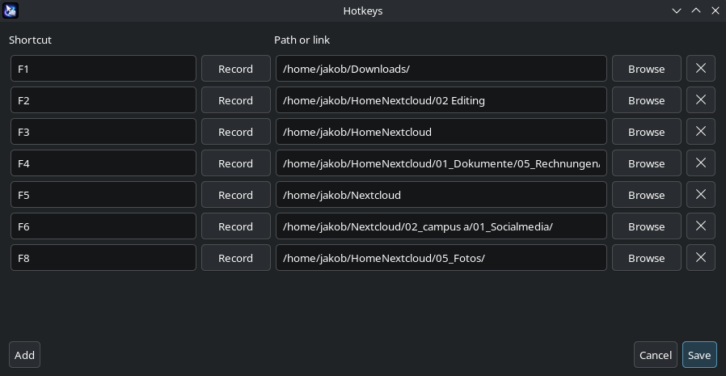
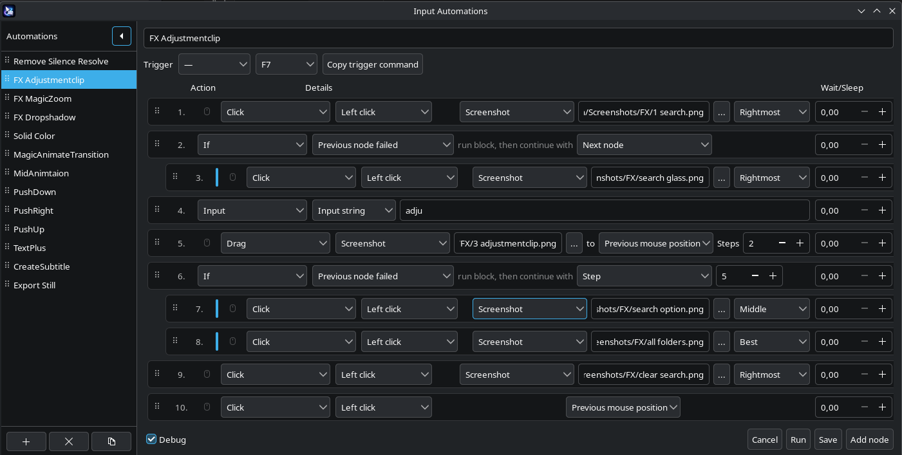
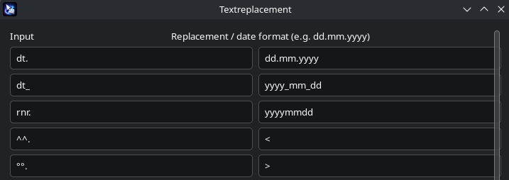
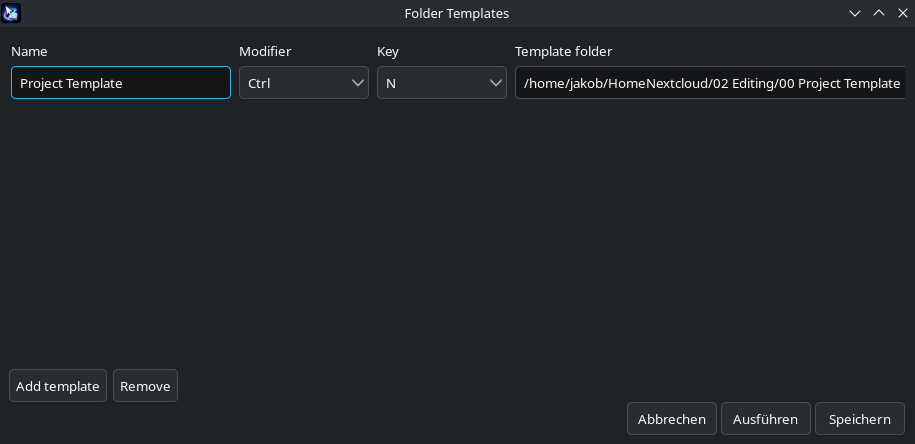

# Input Pilot

A small KDE Wayland tray app for desktop automation.

It maps global hotkeys to folders and links, runs visual click/drag/move
automations from screen templates, expands text snippets as you type, and drops
folder templates into Dolphin — all driven from a single tray icon.

## Requirements

- KDE Plasma on Wayland
- Python 3
- `ydotool` + `ydotoold`
- `wl-clipboard` (`wl-copy` / `wl-paste`)
- GTK 3 Python bindings + AppIndicator GTK 3
- Python OpenCV, NumPy, evdev
- KDE tools: `kreadconfig6`, `kbuildsycoca6`, `kscreen-doctor`

Tested on Fedora KDE. On Fedora the installer offers to pull the packages above
automatically; on other distributions install the equivalents first.

## Quick Start

Install the latest release:

```bash
curl -L https://github.com/RayDurlok/input-pilot/releases/latest/download/input-pilot-linux.tar.gz -o input-pilot-linux.tar.gz
tar xzf input-pilot-linux.tar.gz
cd input-pilot
./install.sh
```

The installer checks dependencies, installs the `input-pilot` launcher into
`~/.local/bin`, and registers the autostart entry. Then start the tray:

```bash
input-pilot
```

Remove everything again with `./uninstall.sh`.

### One-time setup

Text Replacement reads keyboard events from `/dev/input`. Add yourself to the
`input` group once, then log out and back in:

```bash
sudo usermod -aG input "$USER"
```

Mouse/keyboard automation needs an accessible `ydotoold` socket. Configure the
persistent service once:

```bash
./install-ydotool-service.sh
```

`F12` is a global emergency stop while the tray runs — it aborts any running
template click or automation and releases held mouse buttons.

## Support

If you want to support my work:

[](https://www.paypal.com/donate/?hosted_button_id=V4HH8D9L36UPG)

## Tray

Everything is configured from the tray menu:

- **Hotkeys…** — global shortcuts to folders and links
- **Input Automations…** — visual click/drag/move/type sequences
- **Folder Templates…** — drop template folders into Dolphin
- **Textreplacement…** — type-as-you-go text snippets

The tray warms a small local template server so OpenCV stays loaded between
clicks. Template matching uses KWin's `ScreenShot2` API and verifies the last
known position with a small cached screenshot before falling back to a full
search, keeping repeated actions fast.

## Hotkeys



Map global shortcuts to a local path or a link. Each row has its own modifier
and key dropdown; `Add` / `Remove` manage the list and saving rejects duplicate
shortcuts. Supports modifiers (`Ctrl+Alt+Shift+2`), function keys, letters,
numbers, and navigation keys.

When a function-key target is a local folder, the key becomes context-aware: it
opens the folder normally, but if a Save/Open dialog is focused it pastes the
folder path into the dialog instead. `Shift+<key>` stays available as an
explicit file-dialog helper.

## Input Automations



Build named automations from a list of nodes. The collapsible sidebar lists all
automations — click to switch, drag the `⠿` handle to reorder, and use the
toolbar to add, duplicate, or remove (with confirmation). Each automation can
have its own trigger hotkey.

Each node has an action and the fields it needs:

| Action | What it does |
| --- | --- |
| `Click` | Click a screenshot template, fixed X/Y, or the start position |
| `Drag` | Press at the source, release at the target (with interpolated `Steps`) |
| `Move mouse` | Hover to a target without clicking (smooth move optional) |
| `Input` | Send a key combo (`Ctrl+S`), paste text, or type text key-by-key |
| `If` | Block container that runs its indented children conditionally |

Targets can be **screenshot templates**, **fixed coordinates**, or the
**previous mouse position** captured when the run started. When a template
matches in several places, pick which one to use (`Best`, `Rightmost`,
`Middle`, `Leftmost`, `Topmost`, `Bottommost`). Click and Move nodes can enable
the mouse-pointer toggle to animate the cursor instead of jumping.

`If` nodes work like block coding. Conditions (`Previous node failed`,
`Previous node succeeded`, `Always`) decide whether the indented children run.
Drag-and-drop is block-aware — moving an `If` row carries its children. After a
block finishes it continues with the **Next node** by default, or jumps to a
chosen **Step** (useful for recovery loops, e.g. back to step 1 after reopening
a missing panel). A run stops automatically after 3 jumps.

Nodes reorder by dragging the `⠿` handle; clicking a row number opens a note
popover, shown as a tooltip on rows that have one.

Trigger an automation from the command line — the `Copy trigger command` button
copies the ready-to-run command:

```bash
input-pilot-mouse-sequence.py --id auto-123456789abc
```

IDs are stable across renames and reordering. `--name <name>` and `--index <n>`
also work; omitting all three defaults to index 1. Automations are stored in
`~/.config/wayland-automation/mousemove-sequence.json`.

## Text Replacement



Type a trigger followed by space and it is replaced inline. Entries live in
`~/.config/wayland-automation/text-replacements.json`:

```json
[
  { "trigger": "hl.", "replacement": "Hello!", "enabled": true }
]
```

Replacements are inserted via clipboard paste (`wl-copy` + `Ctrl+V`), so every
Unicode character and special symbol works regardless of keyboard layout. The
original clipboard is restored afterwards. Use `{enter}` anywhere in a
replacement to insert a Shift+Enter line break.

Date snippets use `dd`, `mm`, `yy`, and `yyyy` tokens:

```json
[
  { "trigger": "dt.",  "date_format": "dd.mm.yyyy", "enabled": true },
  { "trigger": "dt_",  "date_format": "yyyy_mm_dd", "enabled": true },
  { "trigger": "rnr.", "date_format": "yyyymmdd",   "enabled": true }
]
```

All entries are editable in the `Textreplacement…` dialog. Any value made only
of date tokens and separators (`.` `-` `_` `/`) is stored as a date format.

## Folder Templates



Map a hotkey to a template folder. Pressing it while Dolphin is active copies
that folder into the current Dolphin directory and prompts for a name. The
default config maps `Ctrl+N` to the first template. Stored in
`~/.config/wayland-automation/folder-templates.json`.

## Extras

Persistent ydotool service:

```bash
./install-ydotool-service.sh        # install + enable
./start-ydotool-automation-service.sh   # transient, run manually
```

Key detector — a focused window that logs key presses to
`~/.local/state/wayland-automation/`:

```bash
./detect-key.py
```

## Repository Layout

```text
wayland-automation-tray.py        Tray app and all configuration dialogs
input-pilot-mouse-sequence.py     Automation runner (CLI + triggers)
input-pilot-template-server.py    Warm OpenCV template-matching server
input-pilot-text-replacement.py   Type-as-you-go replacement engine
input-pilot-folder-template.py    Dolphin folder-template helper
wayland-click-image.py            Screen-template click/drag/move core
install.sh / uninstall.sh         Installer and uninstaller
```

## License

GPLv3.
